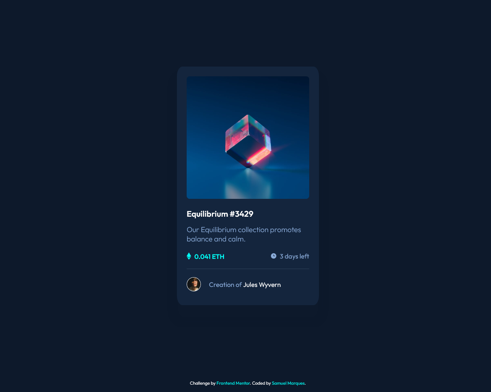
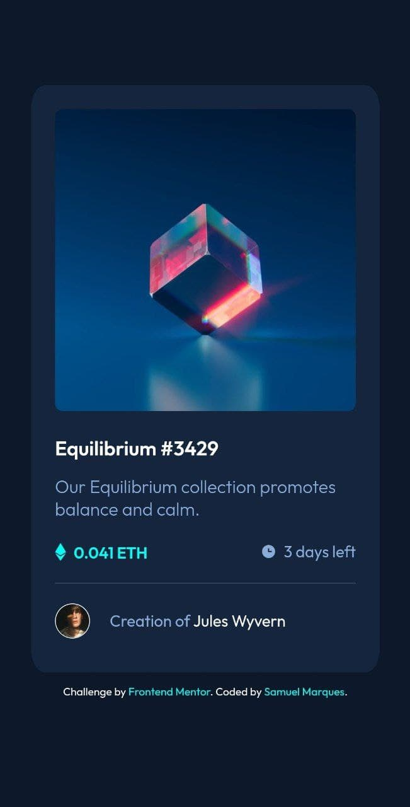

# NFT preview card component

This is a solution to the [NFT preview card component challenge on Frontend Mentor](https://www.frontendmentor.io/challenges/nft-preview-card-component-SbdUL_w0U). Frontend Mentor challenges help you improve your coding skills by building realistic projects. 

## Table of contents

- [NFT preview card component](#nft-preview-card-component)
	- [Table of contents](#table-of-contents)
	- [Overview](#overview)
		- [The challenge](#the-challenge)
		- [Screenshots](#screenshots)
		- [Links](#links)
	- [My process](#my-process)
		- [Built with](#built-with)
	- [Author](#author)

## Overview

### The challenge

Users should be able to:

- View the optimal layout depending on their device's screen size
- See hover states for interactive elements

### Screenshots

### Links

- Solution URL: [https://github.com/samuel-s-marques/NFT-preview-card-component](https://github.com/samuel-s-marques/NFT-preview-card-component)
- Live Site URL: [https://samuel-s-marques.github.io/NFT-preview-card-component/](https://samuel-s-marques.github.io/NFT-preview-card-component/)

## My process

### Built with

- Semantic HTML5 markup
- SCSS
- Flexbox
- Mobile-first workflow

## Author

- Website - [Samuel Marques' portfolio](https://samuel-s-marques.github.io/)
- Frontend Mentor - [@samuel-s-marques](https://www.frontendmentor.io/profile/samuel-s-marques)